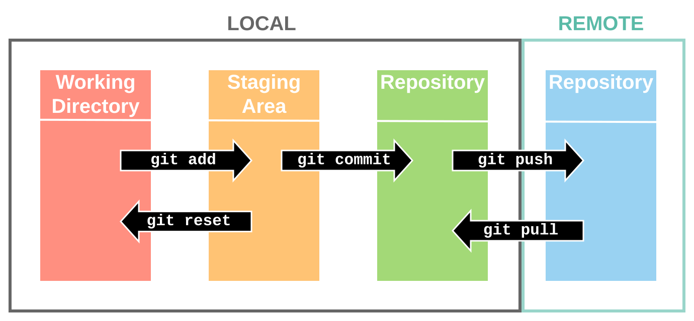

# git

As we work on programs, we want to be sure at any point in time that what we are saving is exactly what we want, no more, no less. Versioning is a system that saves snapshots of an entire codebase (read: folder) to be able to move between if its ever needed.

The most important scenario where versioning is relevant is when deleting is at play. Imagine deleting a critical file without having a way to get it back. Versioning would allow us to roll back to before it was deleted to get access to it. Without versioning or other safeguards, this critical file could have been lost permanently.

---

## So how does git work?

The git processes we will be using are just the beginning of what git is capable of, but are the core reasons we will be using it. Check out this diagram:

There's a lot going on in this diagram so let's break it down by looking first at the colored categories:

- Red - **Local Working Directory** - this is where we are used to working, where we can normally "save" a file. Notice that this is the first section, meaning that this is going to be the "least safe" place for our work to be. None of the versioning applys at this point, but it is the easiest place to get our work done.
- Yellow - **Local Staging Area** - this is where we start to communicate with git about what we want to be versioning. Just like in real life, this staging area is where we point out the files and folders we want to keep track of. It is important to note that things are not actively saved in the staging area, but are preparing to be saved by git.
- Green - **Local Repository** - this is officially the place where git has versioned files and folders. It has saved information about the current state of things and allows you continue moving forward in your working directory while understanding that this is now a safe position to fall back to if needed while you work. The only unsafe thing now is that the information is only stored on my computer, _locally_, and is not backed up to the internet.
- Blue - **Remote Repository** - this is where git communicates all your versioning information to a repository on another computer, which for us will be a datacenter provided by GitHub. Once GitHub has the information, we are at our safest as now if something physically happens to your computer, we can get the information back from GitHub if needed.

Now let's talk about the black arrows moving between the categories. These represent commands that would typically be used in a terminal (like Windows' Command Prompt). Each one is preceded by `git` as a way to tell the computer to interpret the next command as one related to git. Let's break them down:

- `add` - this is how we tell git about which of our local files we want to track to be incorporated into the versioning. This keeps the files in the local working directory, but adds them to the local staging area to potentially be saved into the version.
- `commit` - this is how we tell git to take a snapshot of all of the files and folders in the local staging area to create a new version. This will often come with a note that we call a **commit message** that explains what is being captured in this version, usually referencing what has been added/changed/removed from previous saved versions.
- `push` - this is how we tell git to send a committed version to our remote repository (GitHub) to be saved in a separate place. We often think of it as being _pushed_ out to the internet. This is how we can keep access to things done at home when we go to school (and vice-a-versa).
- `pull` - this is how we get the most recently committed versions of things from our remote repository (GitHub) so that we are working with the most recent files. This could be if something happened to our local computer and lost the files, or if we did work on another computer (let's say on your computer at home) and now want to work on it from another computer (let's say your computer at school).
- `reset` - we will not be using this.

You will often hear me say "don't forget to add, commit, and push your work!" when we work in class. This is me saying to move your local working directory work to the staging area (add), capture it as a version (commit), and upload it to GitHub (push). This way the work is not stuck on your desktop from class. Whenever you make progress on any assignment for this class, you should always add, commit, and push your work to keep GitHub updated.

---

## git vs. GitHub

To put it simply, git is the method by which we are saving our files and folders, and GitHub is a service that gives us an easy place to use as a remote repository and move our work between devices.

---

## Using GitHub Desktop to use git

GitHub Desktop gives us an easy way to work with a repository, including ways to handle all of our previously-discussed commands.

First, we need a repository to work with. To make this easiest, we can start by using this repository with the git and GitHub notes. The critical thing we need in order to use this repository in GitHub Desktop is the GitHub link from our web browser that leads to the repository.
